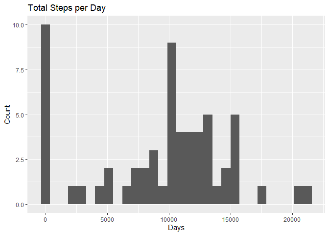
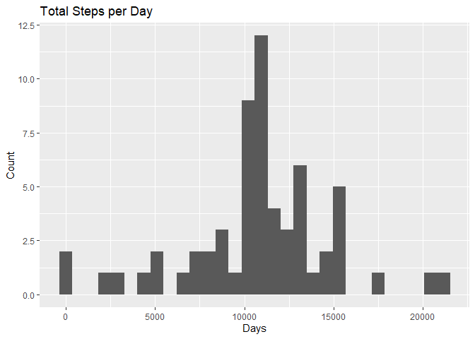
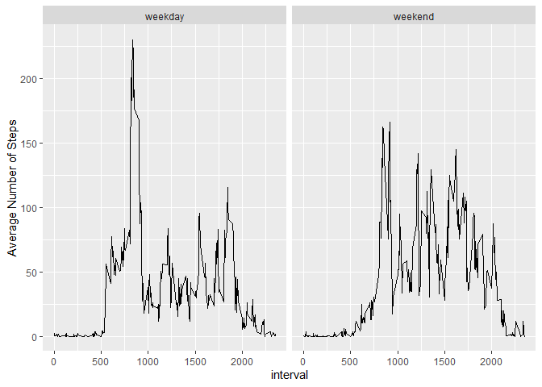

```r
library(dplyr)
```

```
## 
## Attachement du package : 'dplyr'
```

```
## Les objets suivants sont masqués depuis 'package:stats':
## 
##     filter, lag
```

```
## Les objets suivants sont masqués depuis 'package:base':
## 
##     intersect, setdiff, setequal, union
```

```r
library(ggplot2)
library(lubridate)
```

```
## Warning: le package 'lubridate' a été compilé avec la version R 4.1.1
```

```
## 
## Attachement du package : 'lubridate'
```

```
## Les objets suivants sont masqués depuis 'package:base':
## 
##     date, intersect, setdiff, union
```


## Loading and preprocessing the data
We start by unzipping **activity.zip** and loading the data :

```r
unzip("activity.zip",file="activity.csv")
data<-read.csv("activity.csv")
```

We first thing we might want to see is the dimension and the variable names of **data** :

```r
print(dim(data))
```

```
## [1] 17568     3
```

```r
print(names(data))
```

```
## [1] "steps"    "date"     "interval"
```

Next we might want to see the first few rows of the data and it's structure :


```r
print(head(data))
```

```
##   steps       date interval
## 1    NA 2012-10-01        0
## 2    NA 2012-10-01        5
## 3    NA 2012-10-01       10
## 4    NA 2012-10-01       15
## 5    NA 2012-10-01       20
## 6    NA 2012-10-01       25
```

```r
print(str(data))
```

```
## 'data.frame':	17568 obs. of  3 variables:
##  $ steps   : int  NA NA NA NA NA NA NA NA NA NA ...
##  $ date    : chr  "2012-10-01" "2012-10-01" "2012-10-01" "2012-10-01" ...
##  $ interval: int  0 5 10 15 20 25 30 35 40 45 ...
## NULL
```

We notice 2 interesting things :  
1.First, the **date** column is a character vetor where it should be a Date format vector, we correct this by the following code :


```r
data$date<-ymd(data$date)
```
2.Second, we see a lot of NA's in the head of the steps column, we might want to check what is the percentage of NA's for this column :

```r
mean(is.na(data$steps))
```

```
## [1] 0.1311475
```

Therefore we have 13.1% of NA's, which means we don't have to worry too much about it and there must be a reason why there is a lot of missing values in the first rows.


## What is mean total number of steps taken per day?  
### Calculating the total number of steps per day :  

To get the total number of steps per day we use the group_by and summarize strategy :

```r
steps_per_date<-data%>%group_by(date)%>%summarize(total.steps=sum(steps,na.rm=TRUE))
steps_per_date
```

```
## # A tibble: 61 x 2
##    date       total.steps
##    <date>           <int>
##  1 2012-10-01           0
##  2 2012-10-02         126
##  3 2012-10-03       11352
##  4 2012-10-04       12116
##  5 2012-10-05       13294
##  6 2012-10-06       15420
##  7 2012-10-07       11015
##  8 2012-10-08           0
##  9 2012-10-09       12811
## 10 2012-10-10        9900
## # ... with 51 more rows
```
We notice that the result is a 61 by 2 data frame (i.e there are 61 dates)  
   
### Making a histograme of the total number of steps per day  
To do that we use the ggplot2 plotting system and the function q plot :

```r
qplot(steps_per_date$total.steps,geom="histogram",xlab="Days",ylab="Count", main="Total Steps per Day")
```

```
## `stat_bin()` using `bins = 30`. Pick better value with `binwidth`.
```

<!-- -->
   
### Computing the mean and median of the total number of steps taken per day  
To compute the mean and median of the total number of steps taken per day we can cal the function summary :

```r
summary(steps_per_date$total.steps)
```

```
##    Min. 1st Qu.  Median    Mean 3rd Qu.    Max. 
##       0    6778   10395    9354   12811   21194
```
We see that the mean is 9354 and the median is 10395. 
   
## What is the average daily activity pattern?  
### Making a time series plot of the 5-minute interval (x-axis) and the average number of steps taken, averaged across all days (y-axis)

We start by making the right data frame that will allow us to make the plot, and we do this by grouping **data** by the **interval** variable and summarizing by taking the mean of the steps for each interval :

```r
steps_per_interval<-data%>%group_by(interval)%>%summarize(mean.steps=mean(steps,na.rm=TRUE))
head(steps_per_interval)
```

```
## # A tibble: 6 x 2
##   interval mean.steps
##      <int>      <dbl>
## 1        0     1.72  
## 2        5     0.340 
## 3       10     0.132 
## 4       15     0.151 
## 5       20     0.0755
## 6       25     2.09
```
Then, we can make the plot :

```r
with(steps_per_interval,plot(interval,mean.steps,type="l",xlab="Time interval",ylab="average number of steps",main="Average Number of Steps by 5-minute Interval"))
```

<!-- -->
   
### Which 5-minute interval, on average across all the days in the dataset, contains the maximum number of steps? 


```r
print(with(steps_per_interval,interval[which.max(mean.steps)]))
```

```
## [1] 835
```
We see the 5-minute interval that contains the maximum number of steps is the 835th


## Imputing missing values
### Calculate and report the total number of missing values in the dataset 


```r
print(sum(is.na(data$steps)))
```

```
## [1] 2304
```
The number of missing values is : 2304
   
### Filling in all of the missing values in the dataset
We will fill the missing values in the data set by assigning to them the mean of the total number of steps for that interval (averaged across all days) using the **step_per_interval** data frame :


```r
data2<-data.frame(date=data$date,interval=data$interval,steps=rep(0,times=length(data)))
for(i in 1:length(data$steps)){
        if(is.na(data$steps[i]))
                data2$steps[i]<-with(steps_per_interval,mean.steps[interval==data$interval[i]])
        else
                data2$steps[i]<-data$steps[i]
}
head(data2)
```

```
##         date interval     steps
## 1 2012-10-01        0 1.7169811
## 2 2012-10-01        5 0.3396226
## 3 2012-10-01       10 0.1320755
## 4 2012-10-01       15 0.1509434
## 5 2012-10-01       20 0.0754717
## 6 2012-10-01       25 2.0943396
```
    
### Histogram of the total number of steps taken each day
We use the same method we used for the **data** variable, we make the data set that we need :

```r
steps_per_date2<-data2%>%group_by(date)%>%summarize(total.steps=sum(steps,na.rm=TRUE))
head(steps_per_date2)
```

```
## # A tibble: 6 x 2
##   date       total.steps
##   <date>           <dbl>
## 1 2012-10-01      10766.
## 2 2012-10-02        126 
## 3 2012-10-03      11352 
## 4 2012-10-04      12116 
## 5 2012-10-05      13294 
## 6 2012-10-06      15420
```
And then we have the histogram:

```r
qplot(steps_per_date2$total.steps,geom="histogram",xlab="Days",ylab="Count", main="Total Steps per Day")
```

```
## `stat_bin()` using `bins = 30`. Pick better value with `binwidth`.
```

<!-- -->
   
###  Calculate and report the mean and median total number of steps taken per day 
As before, to compute the mean and median of the total number of steps taken per day we can cal the function summary :

```r
summary(steps_per_date2$total.steps)
```

```
##    Min. 1st Qu.  Median    Mean 3rd Qu.    Max. 
##      41    9819   10766   10766   12811   21194
```
We see that the mean is 15876 and the median is 15838. 

These values do differ from those estimated before: the mean and mediane are much higher.  

## Are there differences in activity patterns between weekdays and weekends?

### Create a new factor variable in the dataset with two levels – “weekday” and “weekend” indicating whether a given date is a weekday or weekend day

```r
weekday<-weekdays(data2$date)
data2$weekday<-as.factor(weekday== "samedi" | weekday=="dimanche") #sorry i don't know how to make the names in english
levels(data2$weekday)<-c("weekday","weekend")
```
   
### Make a panel plot containing a time series plot of the 5-minute interval (x-axis) and the average number of steps taken, averaged across all weekday days or weekend days (y-axis)

We start by creating a new data frame with the data that we need :

```r
temp<- data2%>%group_by(interval,weekday)%>%summarize(mean.steps=mean(steps),.groups = "keep")
head(temp)
```

```
## # A tibble: 6 x 3
## # Groups:   interval, weekday [6]
##   interval weekday mean.steps
##      <int> <fct>        <dbl>
## 1        0 weekday     2.25  
## 2        0 weekend     0.215 
## 3        5 weekday     0.445 
## 4        5 weekend     0.0425
## 5       10 weekday     0.173 
## 6       10 weekend     0.0165
```
and wr plot using the ggplot2 plotting system : 

```r
with(temp,qplot(interval,mean.steps,facets=.~weekday,geom="line",xlab="interval",ylab="Average Number of Steps"))
```

<!-- -->


